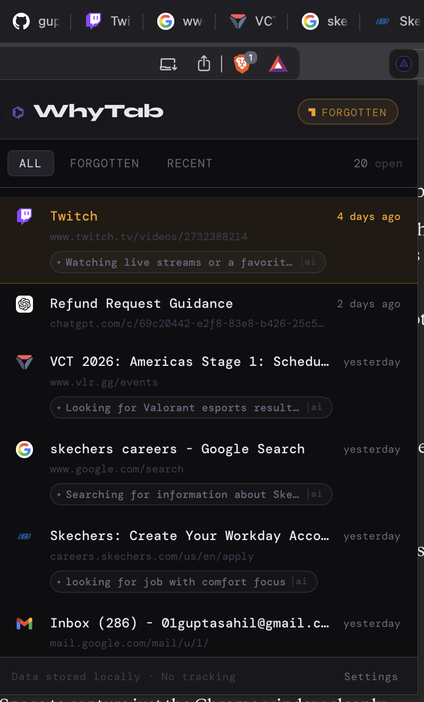
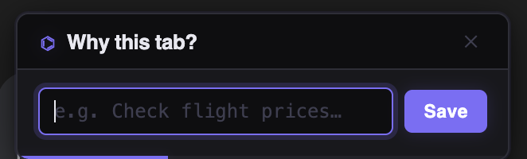
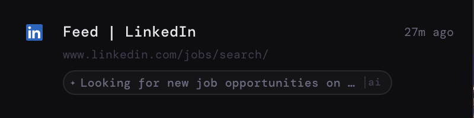
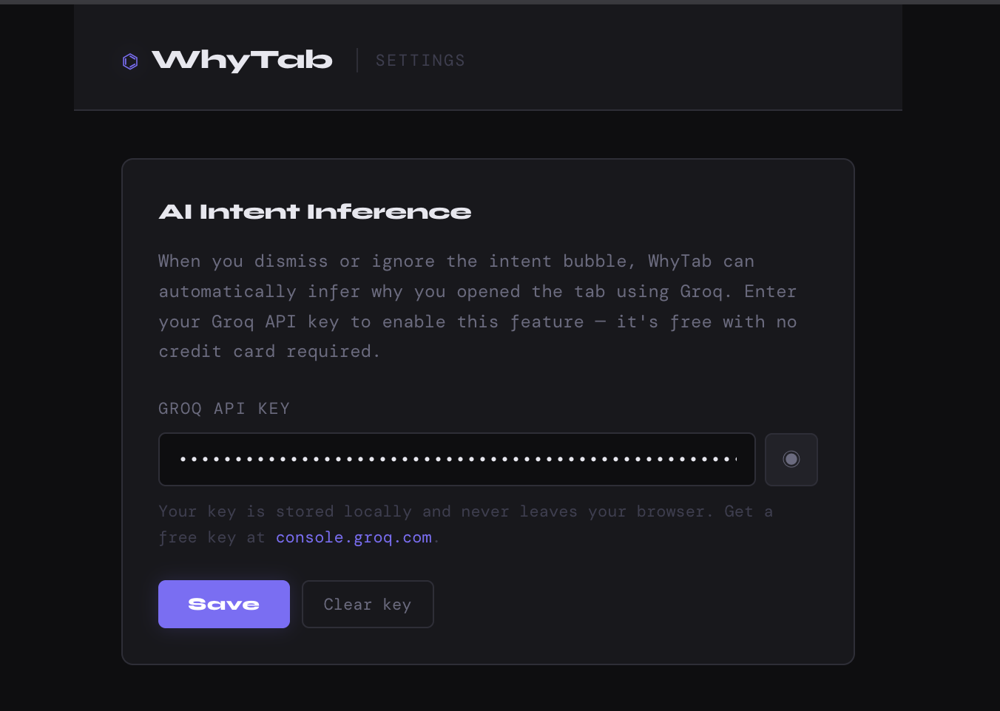

# WhyTab ⌬

> *"Why do I have this tab open?"*

WhyTab is a Chrome extension that helps you stay intentional about your browser tabs. It captures why you opened a tab, infers intent using AI when you don't, and surfaces tabs you've forgotten about — before they pile up into chaos.



---

## Features

### Intent Capture
When you open a new tab, a small floating bubble appears asking *"Why this tab?"*. Type a quick reason and hit Save. It takes two seconds and makes your tab bar meaningful.



### AI Intent Inference
If you dismiss or ignore the bubble, WhyTab uses [Groq](https://console.groq.com) (free, no credit card) to automatically infer what the tab is likely for based on its title and URL. AI-inferred intents appear with a subtle `✦ ai` tag so you always know the source.



### Forgotten Tab Detection
Tabs you haven't visited in 3+ days are flagged as **forgotten** — highlighted in amber with a count in the header. Use the Forgotten filter to review and close what you no longer need.

### Local-first, No Tracking
All tab data is stored in `chrome.storage.local`. Nothing is sent anywhere except the title and URL to Groq when inferring intent (and only if you've configured a key). No analytics. No accounts.

---

## Installation

WhyTab is not yet on the Chrome Web Store. Install it manually in a minute:

1. Clone or download this repo
2. Go to `chrome://extensions`
3. Enable **Developer mode** (top right toggle)
4. Click **Load unpacked** and select the project folder
5. Pin the ⌬ icon to your toolbar

---

## Setup (AI Inference)

AI intent inference is optional but recommended — it's powered by Groq's free tier.

1. Sign up at [console.groq.com](https://console.groq.com) and create a free API key
2. Click the WhyTab icon → **Settings** in the footer
3. Paste your key (`gsk_...`) and hit Save



That's it. WhyTab will now infer intent automatically for any tab you don't answer.

---

## How It Works

**Phase 1 — Tab tracking**
WhyTab's service worker listens to `onCreated`, `onUpdated`, `onActivated`, and `onRemoved` tab events to track when each tab was opened and last visited. Stale tabs (3+ days unvisited) are surfaced in the popup.

**Phase 2 — Intent capture**
When a tab finishes loading, WhyTab injects a content script that renders the intent bubble. The bubble auto-dismisses after 10 seconds, pauses if you focus the input, and responds to Escape/Enter. The intent is sent back to the service worker via `chrome.runtime.sendMessage` and stored in `chrome.storage.local`.

**Phase 3 — AI inference**
If no intent is captured, the service worker calls the Groq API (`llama-3.1-8b-instant`) with the tab's title and URL and asks for a short phrase describing why the tab was likely opened. The result is stored as `aiIntent` and displayed with a distinct muted style. User-provided intent always takes priority and overwrites any AI inference.

---

## Tech Stack

- **Manifest V3** Chrome Extension
- Vanilla JS — no frameworks, no build step
- `chrome.scripting` for programmatic content script injection
- `chrome.storage.local` for all persistence
- `chrome.alarms` for the hourly stale tab check
- [Groq API](https://console.groq.com) (`llama-3.1-8b-instant`) for intent inference
- [Syne](https://fonts.google.com/specimen/Syne) + [DM Mono](https://fonts.google.com/specimen/DM+Mono) for typography

---

## File Structure

```
whytab/
├── background.js      # Service worker — tab lifecycle, AI inference
├── content.js         # Injected bubble UI
├── content.css        # Bubble styles (scoped to #whytab-*)
├── popup.html         # Extension popup
├── popup.js           # Popup logic
├── popup.css          # Popup styles
├── options.html       # Settings page
├── options.js         # API key management
├── options.css        # Settings styles
└── manifest.json      # MV3 config
```

---
